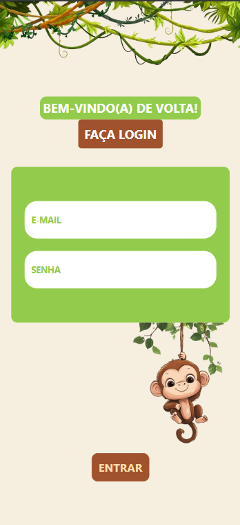
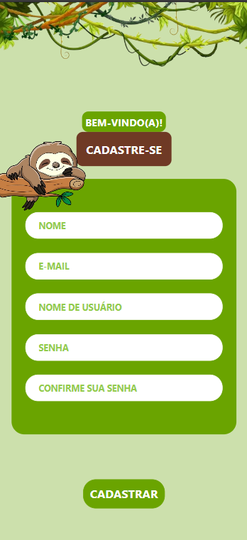
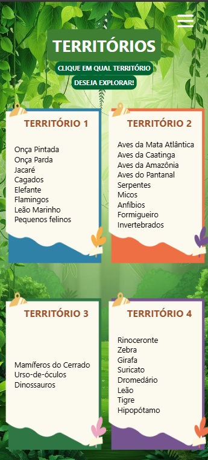

# 🐾 ZooKids

**ZooKids** é um aplicativo educacional infantil desenvolvido em **React Native**, com o objetivo de ensinar as crianças sobre os animais encontrados em um zoológico de forma interativa e divertida.

## 📱 Funcionalidades

- 🐒 Visualização de diferentes animais do zoológico  
- 🎨 Interface colorida e intuitiva para o público infantil  
- 💡 Informações básicas e curiosidades sobre cada animal  

## 🚀 Tecnologias Utilizadas

- [React Native](https://reactnative.dev/)  
- [Expo](https://expo.dev/)  
- JavaScript (ES6+)  
- Estilização com StyleSheet

## 🧭 Navegação entre Telas

O aplicativo utiliza o **React Navigation** com `StackNavigator` para permitir uma navegação fluida entre as telas.

A navegação é gerenciada através da biblioteca `@react-navigation/native` e `@react-navigation/stack`, garantindo uma transição intuitiva entre páginas e melhor experiência do usuário.

### Exemplo de estrutura de navegação:

```javascript
import { createStackNavigator } from '@react-navigation/stack';
import HomeScreen from './screens/HomeScreen';
import AnimalListScreen from './screens/AnimalListScreen';
import AnimalDetailScreen from './screens/AnimalDetailScreen';

const Stack = createStackNavigator();

function AppNavigator() {
  return (
    <NavigationContainer>
      <Stack.Navigator initialRouteName="Home">
        <Stack.Screen name="Home" component={HomeScreen} />
        <Stack.Screen name="Animals" component={AnimalListScreen} />
        <Stack.Screen name="Details" component={AnimalDetailScreen} />
      </Stack.Navigator>
    </NavigationContainer>
  );
}
```

## 🛠️ Como Executar o Projeto

```bash
# 1. Clone este repositório
git clone https://github.com/Gisele-Nuness/app-zookids.git

# 2. Acesse a pasta do projeto
cd app-zookids

# 3. Instale as dependências
npm install

# 4. Inicie o projeto com Expo
npx expo start
```
Abra o aplicativo **Expo Go** no seu celular e escaneie o QR Code exibido no terminal ou navegador para rodar o app no dispositivo.

## 📷 Capturas de Tela

### Tela Login



### Tela de Cadastro



### Tela Home



## 👶 Público-Alvo

Crianças de 3 a 8 anos que estejam aprendendo sobre os animais.


## 👩‍💻 Desenvolvido por

**Gisele Nunes e Esther Nascimento**  
[LinkedIn Gisele](https://www.linkedin.com/in/gisele-nuness)
[LinkedIn Esther](https://www.linkedin.com/in/esthernascimentooficial?utm_source=share&utm_campaign=share_via&utm_content=profile&utm_medium=ios_app)

[GitHub Gisele](https://github.com/Gisele-Nuness)
[GitHub Esther](https://github.com/esthernascimento)
